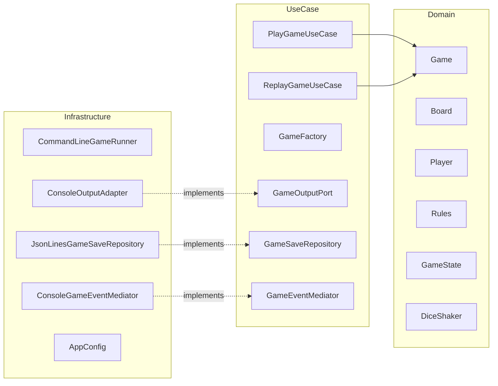

## **Simple Frustration – Console Simulation**

---

## 1. Introduction

This project is a **Simple Frustration** board game that is console-based. I have
implemented it in Java 25 using **Clean Architecture (Ports and Adapters)** and
**object-oriented design principles and patterns** taught throughout
the Software Design and Architecture module.

The primary focus of the project was not only the production a working game, 
but to **demonstrate the ability to design high-quality software** using the 
concepts and techniques introduced and taught throughout the module. Therefore, design quality, 
extensibility, and architectural correctness were prioritised over minimising code size 
or complexity.

In particular, the project mainly centres around:

- clear and enforced separation of concerns
- adherence to all SOLID principles
- justified and appropriate usages of various design patterns
- testability and maintainability of the system
- extensibility for future changes/requirements
- well-defined and rigorously enforced architectural boundaries

This document **critically evaluates** the architectural and design
decisions made, diving into what techniques were used, why they were chosen,
how they were applied, and why alternative approaches were
deliberately not used.

---

## 2. Functional Overview

The system simulates a complete game of Frustration using **console output.**

Functionally, the system does the following:

- configures a board and an appropriate number of players depending on the variation of the game
- automatically alternates turns between players
- rolls either one or two dice depending on the selected configuration
- applies optional rule variations through CLI args
- outputs the relevant messages/information to the console
- detects a winning condition and outputs a summary
- stores completed games
- supports deterministic replay of saved games

---

## 3. How to Run the Application

### Build and Execution

- The program is solely run from the command line as required.
- Despite the fact **Spring Boot** is used, it is **solely used as a dependency
  injection container** for the function of wiring ports, adapters, and use cases.
- There is no Spring-specific logic in the domain or use-case layers.


Because Spring Boot and other dependencies are provided by **Maven**, 
the project must be built before execution.

Building the project is done by running the following command from the project root 
(where the `pom.xml` is located):

```
mvn clean package
```
This command will compile all the source code, run all the unit tests, 
resolve all dependencies, and produces a JAR file in the target/
directory that you can run.

To execute the JAR:

```
java -jar target/game-*.jar [options]
```
Command-Line Flags:

The game is fully customisable with the use of command-line flags. All the flags 
are parsed and handled within the infrastructure layer
(uk.ac.mmu.game.infrastructure.CommandLineGameRunner), this ensures configuration
and delivery concerns remain independent and do not leak into the domain or 
use-case layers.
---
Board Configuration
Flag: --large-board 

Description: Uses the large board variation (36 main positions, 
6 tail positions). The default board
(18 main positions, 3 tail positions) is used if it is not included.
---
Player Configuration 
Flag: --players=N 

Description: Sets the number of players (2 or 4). 
If the --large-board flag is included and fewer than 4 players are provided, 
the system will automatically use 4 players to match the game rules.
---
Dice Configuration
Flag: --single	

Description: Uses a single die instead of the default double-dice 
configuration.
---
Rule Variations
Flag: --exact-end 

Description: players must land exactly on the final square to win.

Flag --forfeit-on-hit

Description: landing on an occupied main-ring square forfeits the move.

---
Save and Replay Features

Flag: --list-saves 

Description: Lists all saved games along with a summary of their 
configuration and recorded dice sequence length.

Flag: --replay=<uuid>

Description: Replays a previously saved game deterministically using 
its recorded dice sequence.
---
Saved games are stored in an append-only JSON Lines (NDJSON) file located at:

```
<project-root>/target/saves/games.json
```

Within the json file we store the game configuration with the exact sequence of 
dice rolls, allowing the ability to deterministically replay games without having to 
serialise internal domain state.

Example Commands:

To play a standard game (small board, 2 players, double dice):
```java -jar target/game-*.jar```

Play a large-board game with 4 players, single die, and all rule variations:
```java -jar target/game-*.jar --large-board --players=4 --single --exact-end --forfeit-on-hit```

List all saved games:
```java -jar target/game-*.jar --list-saves```

Replay a saved game:
```java -jar target/game-*.jar --replay=<uuid>```

Architectural Note:

All the command-line parsing, validation, and routing logic is housed in the
infrastructure layer. Parsed configuration values are passed into use cases
(PlayGameUseCase, ReplayGameUseCase) as primitive values, preserving
Clean Architecture dependency rules and ensuring the domain remains 
completely framework-agnostic.

This design is in line with best practices, we do this by keeping delivery 
mechanisms replaceable without requiring any changes to the core business logic.

## 4. Variations and Advanced Features

- **Rule variations**
    - Exact End rule
    - Forfeit on Hit rule
- **Configurable dice**
    - Single-die or double-die gameplay
- **Persistence**
    - Completed games saved to disk
- **Deterministic replay**
    - Games can be replayed exactly using recorded dice sequence

The variations are implemented using different structural design patterns, for
example the **Decorator** design pattern, allowing behaviour to be added to an 
object at runtime by wrapping it inside another object that has the same interface.
This enables features to be combined freely, without the usage of conditional
logic or an excess amount of subclasses.

---

## 5. Architectural Approach

### 5.1 Clean Architecture (Ports & Adapters)

The codebase is structured using **Clean Architecture**, which can
also be known as **Ports and Adapters**. This design structure was selected because of its
strict separation between core business logic and external concerns.

The project is organised into three layers:

- **Domain layer** – holds all the business logic and game rules
- **Use Case layer** – coordinates application behaviour and workflows
- **Infrastructure layer** – manages input/output, persistence, configuration, 
and frameworks

One integral part of the **Clean Architecture** structure is that **dependencies must always point
inwards**. Here is how it has been done:

- the domain layer has no knowledge of Spring, files, JSON, or console output
- use cases depend only on domain abstractions
- infrastructure depends on domain and use case interfaces

By enforcing this, we can ensure that the domain remains independent of a framework,
is testable in isolation and is also resilient to changes in delivery mechanisms.

#### Clean Architecture vs MVC

Model–View–Controller (MVC) was deliberately not used. MVC assumes a user-driven 
interface and often results in controllers accumulating excessive responsibility. 
This frequently leads to *fat controllers* and *anemic domain models*, both of which
were identified as architectural smells during the module.

Despite Model-View-Controller (MVC) being very dominant in the industry as the go-to 
structure, this was deliberately not used as MVC assumes a user-driven interface
and has risks of allowing controllers to build up into large files and taking on
excess responsibility, leading to the difficulty of maintaining the code when other 
developers begin to work on the codebase. 

Moreover, MVC can lead to what’s called **anemic domain models**. This happens when
the important logic gets pulled out of the main classes and ends up scattered in 
controllers or views. Leaving domain classes holding data, instead of actually doing
anything useful, which makes the code less cohesive and harder to follow.

With Clean Architecture, all the important behaviour lives alongside the data in the
same classes. That’s a much better fit for a project, where there are lots of rules 
and logic at the heart of the system.

---

## 6. Architectural Overview

I have created a component diagram below that walks through the structure of 
the system with the dependency directions also displayed:


This diagram visually reinforces the Dependency Inversion Principle, 
showing that infrastructure components depend on abstractions rather than concrete 
implementations.

## 7. Domain Model Design

#### 7.1 Rich Domain Model

Within the domain layer, all the important rules of the game live in classes including
Game, Board, Player, MoveResult, rule abstractions, dice abstractions and other
explicit game state logic.

The domain model is also created with the intention of keeping the data and the logic that
operates on that data together instead of separate, this helps to make sure we don't have
useless classes lying around. This improves the overall **cohesion and readability** of the system.

The below approach highlights how I have enforced encapsulation and well cohesive code,
making sure that responsibilities are clearly defined and grouped logically.

- The Game class takes care of things like whose turn it is, moving between different 
phases of the game, and making sure all the rules are followed.

- The Board class handles everything to do with player positions—figuring out where everyone is,
managing wrap-around movement, and creating the right labels for each spot on the board.

- The Player class keeps track of how far each player has progressed and keeps a count of
how many turns they've taken.

## 8. Design Patterns in Practice

This section will focus on design patterns, more specifically an evaluation
of each design pattern used, showing and describing where they appear, why it was chosen,
a highlight of the benefits they provide and will cover why alternative design patterns were
deliberately not used.


#### 8.1 Strategy Pattern – Dice Behaviour

The **Strategy Pattern** in a nutshell:

- defines a family of algorithms
- will encapsulate each one
- makes them interchangeable

The algorithm can be selected at runtime without having to change the code that uses it.

New dice strategies can be introduced using this design pattern, adhering to the 
Open for extension/Closed for modification Principle

#### Where used
- Interface: `uk.ac.mmu.game.domain.DiceShaker`
- Implementations:
  - `RandomSingleDiceShaker`
  - `RandomDoubleDiceShaker`
  - `FixedSeqShaker`

```
public interface DiceShaker {
    int shake();
}
```

#### Why used:

The ability to switch between variations, such as a single die or two dice, or even a 
fixed sequence for replays is easily accessible using the strategy pattern, as the rest of
the game code remains the same.

#### Benefits:

- removes conditional logic that can be messy from the game loop

- supports the Open/Closed Principle

- Makes it possible to replay games exactly as they happened, needed for testing or demos

#### Trade-offs:

- introduces additional abstraction layers

#### Why alternatives were rejected:

- conditional logic violates the **Open/Closed Principle**

- inheritance-based game variants can **scale poorly** and **duplicates logic**

#### 8.2 Decorator Pattern – Rule Variations

The Decorator approach makes it easy to mix and match different rule variations by
stacking up as many decorators as you need, allowing everything to still work
through a single, consistent rules interface.

#### Where used

- **Interface:** `uk.ac.mmu.game.domain.Rules`
- **Concrete base implementation:**
  - `BasicRules`
- **Decorator implementations:**
  - `ExactEndDecorator`
  - `ForfeitOnHitDecorator`
- **Composition location:**
  - `uk.ac.mmu.game.usecase.GameFactory` (rules are wrapped conditionally at creation time)

```java
public interface Rules {
  MoveResult apply(Board board, Player current, int roll, List<Player> allPlayers);
}
```

#### Why used:

Decorators give the ability to add multiple rules to be added at the same time
while keeping only one single rules interface.

#### Benefits:

- combine rules however you want

- there is no code or logic duplication

- keeps rules closed for modification, once again adhering to the **Open for extension,
closed for modification** principle

#### Trade-offs:

- increased indirection as behaviour becomes layered through multiple decorators

#### Why alternatives were rejected:

- boolean flags introduce complex conditional logic

- inheritance leads to an unmanageable proliferation of subclasses

#### 8.3 State Pattern – Game Lifecycle

The State pattern allows an object to alter its behaviour when its internal state changes. 
Each state is represented by a separate class, and behaviour is delegated to the current 
state.

The state pattern gives a class the ability to alter
its behaviour depending on what the internal state is. each state will have its
own class responsible for a certain variation of behaviour, the main class hands the work
to whichever class is linked to the current internal state.

#### Where used

- **Interface:** `uk.ac.mmu.game.domain.GameState`
- **Implementations:**
  - `ReadyState`
  - `InPlayState`
  - `GameOverState`
- **Context:**
  - `uk.ac.mmu.game.domain.Game` (delegates turn execution to the active state)

```java
public interface GameState {

    String name();

    default void enter(Game game) {
        // Optional lifecycle hook
    }

    MoveResult playTurn(Game game);
}
```

the below diagram demonstrates the flow of states
```
stateDiagram-v2
    [*] --> Ready
    Ready --> InPlay : first turn
    InPlay --> GameOver : win condition
    GameOver --> GameOver : further turns
```

#### Why used:

By using state objects, as the game moves through its different stages (e.g. Ready to InPlay)
we can replace conditional logic with polymorphism, following best practices.

#### Benefits:

- prevents invalid states

- improves correctness and clarity

#### Trade-offs:

- additional classes

#### 8.4 Observer Pattern – Output and Events

The Factory Pattern makes sure complicated objects are always built the right way 
every time by putting all the creation details in one place. 
Making it much easier to find and make changes.

#### Where used

- **Observer interfaces (domain layer):**
  - `uk.ac.mmu.game.domain.GameObserver`
  - `uk.ac.mmu.game.domain.GameStateObserver`
  - `uk.ac.mmu.game.domain.PlayerTurnObserver`
  - `uk.ac.mmu.game.domain.GameFinishedObserver`

- **Subject (event source):**
  - `uk.ac.mmu.game.domain.Game`

- **Concrete observer implementations (infrastructure layer):**
  - `uk.ac.mmu.game.infrastructure.ConsoleOutputAdapter`

- **Attachment of observers:**
  - `uk.ac.mmu.game.usecase.PlayGameUseCase`
  - `uk.ac.mmu.game.usecase.ReplayGameUseCase`

```java
public interface GameObserver
        extends GameStateObserver, PlayerTurnObserver, GameFinishedObserver {
}
```

#### Benefits:

- domain logic performs no I/O

- output mechanisms are replaceable

- supports testability

#### Why alternatives were rejected:

Direct console output from the domain violates Clean Architecture and Dependency 
Inversion. Ensuring dependencies flow from infrastructure to domain abstractions, 
rather than the domain depending on concrete output mechanisms.

#### 8.5 Factory Pattern – Game Construction

The **Factory Pattern** ensures complex objects are constructed correctly and consistently
through the centralisation of object creation logic, making it easy to locate and modify

#### Where used

- **Factory class (use case layer):**
  - `uk.ac.mmu.game.usecase.GameFactory`

- **Factory methods:**
  - `create2P(...)`
  - `createGame(...)`
  - `createFromSave(...)`

- **Clients of the factory:**
  - `uk.ac.mmu.game.usecase.PlayGameUseCase`
  - `uk.ac.mmu.game.usecase.ReplayGameUseCase`

```java
public class GameFactory {

    public Game createGame(int mainSize,
                           int tailSize,
                           int players,
                           boolean singleDie,
                           boolean exactEnd,
                           boolean forfeitOnHit) {

        DiceShaker baseDice = singleDie
                ? RandomSingleDiceShaker.INSTANCE
                : RandomDoubleDiceShaker.INSTANCE;

        DiceShaker dice = new RecordingDiceShaker(baseDice);

        Board board = new Board(mainSize, tailSize);
        List<Player> playerList = buildPlayers(players);

        Rules rules = buildRules(exactEnd, forfeitOnHit);

        return new Game(board, playerList, rules, dice);
    }
}
```

#### Benefits:

- prevents invalid game construction

- simplifies use case logic

- supports deterministic replay

#### 8.6 Singleton Pattern – Stateless Dice

The **Singleton Pattern** ensures **only one instance** of a class exists, while also
providing a global access point to it.

#### Where used

- **Singleton implementations (domain layer):**
  - `uk.ac.mmu.game.domain.RandomSingleDiceShaker`
  - `uk.ac.mmu.game.domain.RandomDoubleDiceShaker`

- **Access pattern:**
  - Exposed via public static final `INSTANCE` fields
  - Constructor made private to prevent external instantiation

```java
public final class RandomSingleDiceShaker implements DiceShaker {

    public static final RandomSingleDiceShaker INSTANCE =
            new RandomSingleDiceShaker();

    private RandomSingleDiceShaker() { }

    @Override
    public int shake() {
        return random.nextInt(6) + 1;
    }
}
```

#### Benefits:#
- In this case, Singleton is safe because the dice implementations are
  stateless and immutable, avoiding the usual risks associated with global mutable state.

#### Trade-offs:

- If the code were to be extended and begin to use mutable state, it would become unsuitable.

#### 9. SOLID Principles

The SOLID principles gave an essential guide to follow throughout the creation of the
system, by adhering to all aspects these principles, all the code follows the best practices. 

#### 9.1 Single Responsibility Principle (SRP)

This principle is all about making sure each class only has one job to prevent overloading
classes with too much functionality, preventing SRP violations when it is reviewed and 
guaranteeing other developers will not have a difficult time understanding your work.


- Gamefactory does not handle any logic including gameplay, saving or output, its only role
is to build valid game instances.

- Dice behaviour lives in dedicated strategy classes like RandomSingleDiceShaker and 
FixedSeqShaker, instead of being mixed into the game loop.

- Output is handled separately by infrastructure adapters like ConsoleOutputAdapter, so
the core business logic never has to worry about presentation. 

- By giving every class a clearly defined purpose, the code is easier to read, update, 
and test.

- To change how output works or to tweak dice behaviour, you only need touch the relevant code.

#### 9.2 Open/Closed Principle (OCP)

This principle is all about making sure the code is easy to add to without having to 
rewrite or mess around with code that already works. In order to achieve this I primarily
focused on my use of design patterns.

- Rule variations are plugged in using the Decorator pattern (ExactEndDecorator, 
ForfeitOnHitDecorator), so you never have to change the core BasicRules.

- Dice behaviour can be swapped out using the Strategy pattern, meaning you can add new 
dice types without touching the Game class itself.

#### 9.3 Liskov Substitution Principle (LSP)

This principle guides you to create code that can swap out any implementation of an
interface without breaking anything. To adhere to this principle I have:

- All decorators (like ExactEndDecorator and ForfeitOnHitDecorator) implement the same 
Rules interface. 
- You can use any rules object, decorated or not, anywhere a Rules 
instance is expected - no special handling is required.

#### 9.4 Interface Segregation Principle (ISP)

Rather than forcing classes to implement big interfaces that tried to encapsulate all
functionality, I used smaller, focused interfaces. For example:

- Output is managed through simple ports like GameOutputPort instead of one massive interface.
- Observers are abstracted into targeted classes such as GameStateObserver,
  PlayerTurnObserver and GameFinishedObserver so instead of using a large interface where you
  won't need half the code in there, this approach keeps the system easy to work with as you
  know which interfaces are responsible for certain things.

#### 9.5 Dependency Inversion Principle (DIP)

This principle flips the usual dependency direction - high-level parts of the system 
don’t rely directly on the low-level details. Instead, both depend on abstractions. 
In practice:

- The domain layer only talks to interfaces, never to actual infrastructure code. 
- Use cases interact with classes such as GameSaveRepository or GameOutputPort for things
like saving and output as opposed to using concrete classes.
- Infrastructure, including console output or file storage plugs into these abstractions, 
not the other way around. 
- Keeping business logic free of any framework makes it easier to test and makes code more
maintainable

#### 9.6 Summary of SOLID Application

The SOLID principles work together and reinforce each other throughout the project. 
By following them intentionally, the system ends up with:

- Loose coupling between different parts
- High cohesion within each class
- Easy ways to extend or change behaviour without rewriting old code
- Clear boundaries between layers

All of this adds up to a design that’s robust, flexible, and in line with the best
practices.

## 10. Persistence and Replay Functionality

To find completed games they are in an append-only JSON file in JSON Lines (NDJSON) format,
containing its game configurations and dice roll sequences located at:

```
<project-root>/target/saves/games.json
```

To guarantee an identical output as the saved game, we reconstruct a new game and
re-inject the original dice roll sequences and game configurations.

## 11. Testing Strategy
Testing focuses on the domain and use case layers, where the most complex logic 
resides. Domain tests cover rules, decorators, hit detection, board mapping, 
and state transitions. Use case tests employ test doubles and in-memory repositories.

Tests were written where I viewed them as most necessary, in the domain and use case
layers as this is where the most complex logic lives. Domain tests cover rules, 
decorators, hit detection, board mapping, and state transitions while use case tests
use in-memory repositories and mocks. 

Infrastructure components such as Spring configuration and console formatting are 
not extensively tested due to minimal logic and low return on investment, 
reflecting pragmatic testing guidance discussed during the module.

## 12. Evaluation and Reflection
Reviewing my work, I’m happy with how the project turned out, meeting both the 
functional goals and the architectural standards set. Every design 
choice was chosen intentionally, ensuring it aligned with my goal for that specific piece
of code.

#### Strengths

One of the standout strengths is how clearly and strictly the system separates its 
different layers. The domain, use-case, and infrastructure parts are always kept apart, 
so the core business logic never gets tangled up with frameworks, input/output, or how 
the program is delivered.

Another is the high level of test coverage in the most important parts of the 
code—the domain and use-case layers. By keeping the tricky and essential logic away
from outside concerns, I could write tests that are reliable and predictable.

The design is also flexible. If you want to add a new rule or dice behaviour, 
you can do it without needing to mess with any existing code. That shows the design 
patterns and SOLID principles really paid off.

And I’m especially proud of the deterministic replay feature. By recording dice 
rolls instead of saving the whole game state, the system can play back games exactly 
as they happened, using the same core engine. That’s great for both correctness and 
long-term maintenance.

#### Limitations/Trade-offs:

Desipite the fact I ended up with significantly more classes than if I was to disregard
many design choices, the decision was made to take design patterns and architectural
techniques into consideration to make sure the code is easy to maintain,
extend and test in the long run.

If this were a production system, I’d also want to think about things like performance 
tuning, different ways of saving data, or maybe adding more types of user interfaces. 
But for this instance, I believe the trade-offs I made were the right ones.


## 13. Conclusion

This project demonstrates a comprehensive and critically justified application 
of object-oriented design principles, architectural patterns, and testing 
strategies taught throughout the Software Design & Architecture module. 
The final system is fully functional, extensible, testable, and architecturally sound,
with all design decisions being intentional and aligned with best practice.