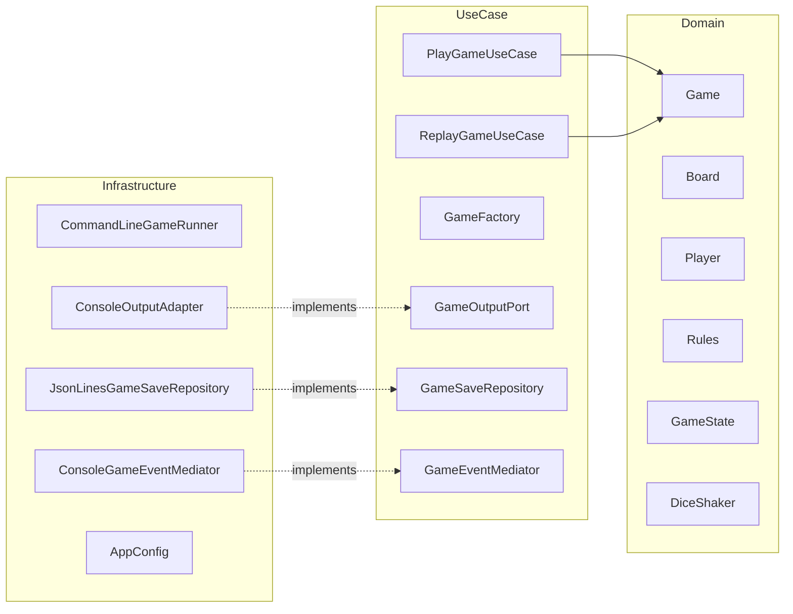

# Software Design & Architecture Report

---

## 1. Introduction

This project is a console-based simulator of a Simple Frustration board game, 
implemented using **Clean Architecture (Ports & Adapters)** in **Java 25**, 
alongside a range of object-oriented design patterns introduced throughout 
the Software Design & Architecture module.

The primary goal of the project is not simply to produce a working game, 
but to demonstrate the ability to design **high-quality software** consistent 
with the principles taught. As a result, the project explicitly focuses on:

- adequate separation of concerns
- adherence to the SOLID principles
- justified and appropriate use of design patterns
- testability and maintainability
- extensibility for future changes
- clearly enforced architectural boundaries

This document provides a critical evaluation of the architectural and design 
decisions made, discussing the techniques employed, the rationale behind their 
selection, and why alternative approaches were deliberately not used.

---

## 2. Functional Overview

The program simulates a complete *Simple Frustration* game using **console 
output only**, as specified.

From a functional perspective, the system:

- sets up a board and configures the required number of players
- automatically alternates turns between players
- rolls either one or two dice depending on the selected game configuration
- applies optional rule variations
- outputs detailed turn-by-turn information to the console
- detects a winning condition and outputs a game summary
- persists completed games
- supports deterministic replay of saved games

Execution is performed via the command line. This decision ensures that 
architectural concerns remain clearly separated from delivery mechanisms.

---

## 3. Architectural Approach

### 3.1 Clean Architecture (Ports & Adapters)

The system is structured using **Clean Architecture**, also known as 
**Ports & Adapters** or **Hexagonal Architecture**. This architectural style 
was selected to enforce a strict separation between business logic and 
external concerns, directly aligning with module learning objectives.

The project is organised into three primary layers:

- **Domain layer** – contains all business logic and game rules
- **Use Case layer** – coordinates application behaviour and workflows
- **Infrastructure layer** – manages input/output, persistence, configuration, and frameworks

In Clean Architecture, **dependencies must always point inwards**, a rule 
that is strictly maintained in this project:

- the domain layer has no knowledge of Spring, files, JSON, or the console
- use cases depend only on domain abstractions
- infrastructure depends on domain and use case interfaces

This approach improves testability, prevents framework concerns from leaking 
into core logic, and allows the system to be extended (for example, 
with a graphical or networked interface) without modifying the domain layer.

#### Why Clean Architecture instead of MVC?

Although Model–View–Controller (MVC) is a commonly taught architectural 
pattern, it was intentionally not used. MVC typically assumes a user-driven 
interface (such as a GUI or web application) and often results in controllers 
accumulating excessive responsibility. This can lead to *fat controllers* 
and *anemic domain models*, both of which were discussed as architectural 
smells during the module.

Clean Architecture, by contrast, promotes a **rich and expressive domain model**,
where behaviour exists alongside data rather than being driven externally. 
This makes it more suitable for rule-heavy, logic-centric systems such as a 
board game simulation.

---

## 4. Architectural Overview (UML Component Diagram)

The UML-style component diagram below illustrates the system’s high-level 
structure and permitted dependency directions:

This diagram visually reinforces the Dependency Inversion Principle, 
demonstrating that infrastructure components depend on abstractions rather 
than concrete implementations.

5. Domain Model Design
   5.1 Rich Domain Model

The domain layer contains the core elements of the game, including Game, 
Board, Player, MoveResult, rule abstractions, dice abstractions, 
and explicit game state logic.

The domain model is intentionally not anemic. Behaviour resides within the 
classes that own the relevant data, improving cohesion and readability. For example:

turn progression, state transitions, and invariant enforcement are handled by Game

Board encapsulates position mapping, wrap-around logic, and label generation

Player manages progress and turn counting

This design reflects lecture guidance on encapsulation and high cohesion, 
ensuring responsibilities are clearly defined and logically grouped.

6. Design Patterns and Their Justification

   6.1 Strategy Pattern – Dice Behaviour

The Strategy pattern is used to model dice behaviour via the DiceShaker 
interface and its concrete implementations (RandomSingleDiceShaker, 
RandomDoubleDiceShaker, and FixedSeqShaker). This allows dice behaviour to 
vary independently of the rest of the game logic.

Dice configurations (single or double) can be selected at runtime, while 
deterministic dice sequences can be injected for testing and replay. An 
alternative approach using conditional logic (e.g. if (singleDie)) was 
rejected, as it would violate the Open/Closed Principle and lead to rigid, 
less maintainable code. Inheritance alone was also insufficient, as it does 
not support flexible runtime substitution as cleanly as Strategy combined with 
composition.

6.2 Decorator Pattern – Rule Variations

The Decorator pattern is used to implement rule variations such as exact end
and forfeit on hit. Each variation wraps an existing Rules implementation and 
enhances its behaviour without modifying it.

This approach allows multiple rule variations to be freely combined while 
preserving a single, consistent rules interface. It also avoids
the unmanageable increase in the number of subclasses that would be 
required by an inheritance-based approach. Boolean flags were deliberately 
avoided, as they would introduce complex conditional logic and violate both 
the Single Responsibility Principle and Open/Closed Principle.

6.3 State Pattern – Game Lifecycle

The lifecycle of the game is modelled using the State pattern, with 
explicit states representing Ready, InPlay, and GameOver. Each state 
defines its own behaviour for playTurn(), preventing illegal transitions 
and replacing scattered conditional logic with polymorphism.

The UML state diagram below illustrates the lifecycle:

stateDiagram-v2
[*] --> Ready
Ready --> InPlay : first turn
InPlay --> GameOver : win condition
GameOver --> GameOver : further turns

This design aligns with module content on managing complex lifecycle 
behaviour safely using state objects.

6.4 Observer Pattern – Output and Events

The Observer pattern is used to decouple domain events from output and side 
effects. The domain emits events such as turns being played or the game 
finishing, while observers (for example, console output adapters) react 
accordingly.

This ensures that:

domain logic performs no I/O

output mechanisms are replaceable

side effects are isolated from core logic

This design promotes low coupling and high testability, both of which were 
emphasised throughout the module.

6.5 Factory Pattern – Game Construction

The Factory pattern is used to centralise game creation. GameFactory is 
responsible for assembling valid combinations of boards, players, rules, 
and dice. This avoids duplication, simplifies use case logic, prevents 
invalid configurations, and supports deterministic reconstruction during replay.

6.6 Singleton Pattern – Stateless Dice

The Singleton pattern is used sparingly for stateless dice implementations. 
Because these classes contain no mutable state, shared access is safe and 
simplifies lifecycle management. This demonstrates a careful and justified
use of Singleton without introducing the risks associated with global mutable
state.

7. Persistence and Replay Design

Completed games are stored in an append-only file located at:

<project-root>/target/saves/games.json

The file uses JSON Lines (NDJSON) format, with each line representing a single
game snapshot. Each snapshot contains configuration details and the sequence
of dice rolls.

Replay is achieved by reconstructing a new game and re-injecting the original
dice roll sequence. This approach avoids fragile state serialisation and 
guarantees identical output by reusing the same game engine.

8. Testing Strategy

Testing focuses primarily on the domain and use case layers, where the 
most complex logic resides. Domain tests validate rules, decorators, hit 
detection, board mapping, and state transitions. Use case tests employ test 
doubles and in-memory repositories to verify orchestration logic without 
relying on I/O or frameworks.

Infrastructure components such as Spring configuration and console 
formatting are not extensively tested, as they contain minimal logic 
and offer limited return on investment. This reflects pragmatic testing 
guidance discussed during the module.

9. SOLID Principles

The project consistently applies the SOLID principles:

Single Responsibility – each class has a clearly defined purpose

Open/Closed – behaviour extended via decorators and strategies

Liskov Substitution – decorators substitute transparently for base rules

Interface Segregation – small, purpose-driven interfaces

Dependency Inversion – core logic depends on abstractions

10. Evaluation and Reflection
    Strengths

The system demonstrates strong architectural boundaries, high test 
coverage of core logic, configurable rules, and deterministic replay. 
The design closely aligns with the principles and techniques taught 
throughout the module.

Limitations and Trade-offs

The primary trade-off is increased architectural complexity and a larger 
number of classes compared to a minimal implementation. This complexity was 
intentionally accepted in order to maximise maintainability, extensibility, 
and design clarity. In a production environment, further considerations such as
performance optimisation, alternative persistence strategies, or additional 
interfaces could be explored.

11. Conclusion

This project demonstrates a holistic and critically justified application of 
object-oriented design principles, architectural patterns, and testing 
strategies taught throughout the Software Design & Architecture module. 
The final system is fully functional, extensible, testable, and 
architecturally sound, with all design decisions being intentional, 
 justified, and aligned with best practice.
