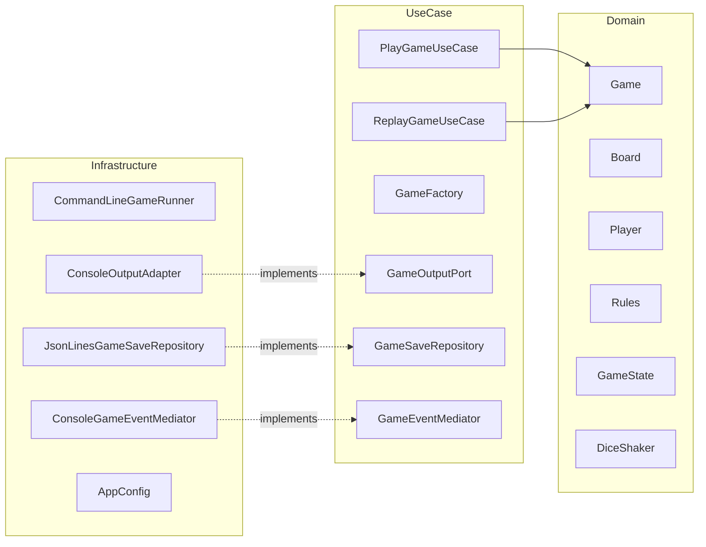

## **Simple Frustration – Console Simulation**

---

## 1. Introduction

This project is a **Simple Frustration** board game that is console-based. I have
implemented it in Java 25 using **Clean Architecture (Ports and Adapters)** and
**object-oriented design principles and patterns** taught throughout
the Software Design and Architecture module.

The primary focus of the project was not only the production a working game, 
but to **demonstrate the ability to design high-quality software** using the 
concepts and techniques introduced and taught throughout the module. Therefore, design quality, 
extensibility, and architectural correctness were prioritised over minimising code size 
or complexity.

In particular, the project mainly centres around:

- clear and enforced separation of concerns
- adherence to all SOLID principles
- justified and appropriate usages of various design patterns
- testability and maintainability of the system
- extensibility for future changes/requirements
- well-defined and rigorously enforced architectural boundaries

This document **critically evaluates** the architectural and design
decisions made, diving into what techniques were used, why they were chosen,
how they were applied, and why alternative approaches were
deliberately not used.

---

## 2. Functional Overview

The system simulates a complete game of Frustration using **only console output.**

Functionally, the system:

- configures a board and an appropriate number of players
- automatically alternates turns between players
- rolls either one or two dice depending on the selected configuration
- applies optional rule variations
- outputs detailed turn-by-turn information to the console
- detects a winning condition and outputs a summary
- stores completed games
- supports deterministic replay of saved games

---

## 3. How to Run the Application

### Build and Execution

- The program is solely run from the command line as required.
- Despite the fact **Spring Boot** is used, it is **solely used as a dependency
  injection container** for the function of wiring ports, adapters, and use cases.
- There is no Spring-specific logic in the domain or use-case layers.


Because Spring Boot and other dependencies are provided by **Maven**, 
the project must be built before execution.

To build the project, run the following command from the project root 
(where the `pom.xml` is located):

```
mvn clean package
```
This command will compile all the source code, run all the unit tests, 
resolve all dependencies, and produces a JAR file in the target/
directory that you can run.

To execute the JAR:

```
java -jar target/game-*.jar [options]
```
Command-Line Flags:

The game is fully customisable with the use of command-line flags. All the flags 
are parsed and handled within the infrastructure layer
(uk.ac.mmu.game.infrastructure.CommandLineGameRunner), this ensures configuration
and delivery concerns remain independent and do not leak into the domain or 
use-case layers.
---
Board Configuration
Flag: --large-board 

Description: Uses the large board configuration (36 main positions, 
6 tail positions). If not included, the default small board 
(18 main positions, 3 tail positions) is used.
---
Player Configuration 
Flag: --players=N 

Description: Sets the number of players (2 or 4). 
If --large-board is specified and fewer than 4 players are provided, 
the system will automatically enforce 4 players to match the game rules.
---
Dice Configuration
Flag: --single	

Description: Uses a single die instead of the default double-dice 
configuration.
---
Rule Variations
Flag: --exact-end 

Description: Enables the Exact End rule variation 
(players must land exactly on the final square to win).

Flag --forfeit-on-hit

Description: Enables the Forfeit on Hit rule variation 
(landing on an occupied main-ring square forfeits the move).

---
Save and Replay Features

Flag: --list-saves 

Description: Lists all saved games along with a summary of their 
configuration and recorded dice sequence length.

Flag: --replay=<uuid>

Description: Replays a previously saved game deterministically using 
its recorded dice sequence.
---
Saved games are stored in an append-only JSON Lines (NDJSON) file located at:

```
<project-root>/target/saves/games.json
```
Each entry in the json file contains the game configuration and the exact 
sequence of dice rolls, this allows the ability to replay deterministically
without having to serialise internal domain state.

Example Commands:

Play a default game (small board, 2 players, double dice):
```java -jar target/game-*.jar```

Play a large-board game with 4 players, single die, and all rule variations:
```java -jar target/game-*.jar --large-board --players=4 --single --exact-end --forfeit-on-hit```

List all saved games:
```java -jar target/game-*.jar --list-saves```

Replay a saved game:
```java -jar target/game-*.jar --replay=<uuid>```

Architectural Note:

All command-line parsing, validation, and routing logic lies within the
infrastructure layer. Parsed configuration values are passed into use cases
(PlayGameUseCase, ReplayGameUseCase) as primitive values, preserving
Clean Architecture dependency rules and ensuring the domain remains 
completely framework-agnostic.


This design reflects best practice by keeping delivery mechanisms
replaceable without requiring changes to the core business logic.

## 4. Variations and Advanced Features

There were also variations/advanced features that were implemented, each with a 
design choice chosen intentionally to support extensibility and maintainability,
which adheres to the open for extension principle of the SOLID principles:

- **Rule variations**
    - Exact End rule
    - Forfeit on Hit rule
- **Configurable dice**
    - Single-die or double-die gameplay
- **Persistence**
    - Completed games saved to disk
- **Deterministic replay**
    - Games can be replayed exactly using recorded dice sequence

The variations are implemented using different structural design patterns, for
example the **Decorator** design pattern, allowing behaviour to be added to an 
object at runtime by wrapping it inside another object that has the same interface.
This enables features to be combined freely, without the usage of conditional
logic or an excess amount of subclasses. Because of this, the codebase remains 
open for extension, while simultaneously avoiding duplication and guaranteeing 
long-term maintainability. 


---

## 5. Architectural Approach

### 5.1 Clean Architecture (Ports & Adapters)

The system is structured using **Clean Architecture**, also referred to as 
**Ports & Adapters** or **Hexagonal Architecture**. This architectural style 
was selected to enforce a strict separation between core business logic and 
external concerns, directly aligning with module learning objectives.

The codebase is created and structured using **Clean Architecture**, also referred
to as **Ports and Adapters**. This design structure was selected due to its strict 
separation between core business logic and external concerns, fitting the brief
like a glove.

The project is organised into three primary layers:

- **Domain layer** – contains all business logic and game rules
- **Use Case layer** – coordinates application behaviour and workflows
- **Infrastructure layer** – manages input/output, persistence, configuration, 
and frameworks

An essential rule of **Clean Architecture** is that **dependencies must always point
inwards**. Here is how we have enforced this:

- the domain layer has no knowledge of Spring, files, JSON, or console output
- use cases depend only on domain abstractions
- infrastructure depends on domain and use case interfaces

By enforcing this, we can ensure that the domain remains independent of a framework,
is testable in isolation and is also resilient to changes in delivery mechanisms.

#### Why Clean Architecture instead of MVC?

Model–View–Controller (MVC) was deliberately not used. MVC assumes a user-driven 
interface and often results in controllers accumulating excessive responsibility. 
This frequently leads to *fat controllers* and *anemic domain models*, both of which
were identified as architectural smells during the module.

Despite Model-View-Controller (MVC) being very dominant in the industry as the go-to 
structure, this was deliberately not used as MVC assumes a user-driven interface
and has risks of allowing controllers to build up into large files and taking on
excess responsibility, leading to the difficulty of maintaining the code when other 
developers begin to work on the codebase. 

Moreover, MVC can also lead to *anemic domain models*, meaning important behaviour
from the domain classes can get pushed out into controllers or views, leaving the 
domain classes acting as data containers instead of actually containing the logic
that actually operates on that data. Making the code less cohesive and unnecessarily
harder to understand.

Clean Architecture, by contrast, promotes a **rich and expressive domain model**, 
where behaviour exists alongside data. This makes it significantly more appropriate
for a rule-heavy, logic-centric system such as a board game simulation.

---

## 6. Architectural Overview (UML Component Diagram)

The UML-style component diagram below illustrates the high-level structure of 
the system and the enforced dependency directions:


This diagram visually reinforces the Dependency Inversion Principle, 
showing that infrastructure components depend on abstractions rather than concrete 
implementations.

## 7. Domain Model Design

7.1 Rich Domain Model

The domain layer contains the core concepts of the game, including Game, Board, 
Player, MoveResult, rule abstractions, dice abstractions, and explicit game state logic.

The domain model is intentionally designed to have each class keep the 
data and the logic that operates on that data. improving cohesion and readability,
which we touched on earlier:

- Game manages turn progression, state transitions, and invariant enforcement

- Board encapsulates position mapping, wrap-around logic, and label generation

- Player manages progress and turn counting

This reflects module guidance on encapsulation and high cohesion, ensuring 
responsibilities are clearly defined and logically grouped.

## 8. Design Patterns in Practice

This section critically evaluates each design pattern used, explaining where it 
appears, why it was chosen, what benefits it provides, what trade-offs it 
introduces, and why alternatives were rejected.

8.1 Strategy Pattern – Dice Behaviour

Where used:

DiceShaker interface and implementations such as RandomSingleDiceShaker, 
RandomDoubleDiceShaker, and FixedSeqShaker.

The Strategy pattern encapsulates dice-rolling behaviour behind a common interface, 
allowing it to vary independently of the game engine.

```
public interface DiceShaker {
    int roll();
}
```

Why used:
Dice behaviour changes independently of the game rules. Strategy allows runtime 
selection (single vs double dice) and deterministic sequences for testing and replay.

Benefits:

- removes conditional logic from the game loop

- supports Open/Closed Principle

- enables deterministic replay

Trade-offs:

- introduces additional abstraction layers

- Why alternatives were rejected:

- conditional logic (if (singleDie)) violates OCP

- inheritance-based game variants duplicate logic and scale poorly

8.2 Decorator Pattern – Rule Variations

Where used:

Rules interface with decorators such as ExactEndDecorator and ForfeitOnHitDecorator.

The Decorator pattern allows rule behaviour to be extended without modifying 
existing code.

Why used:

Rule variations must be composable. Decorators allow multiple variations to be 
applied simultaneously while preserving a single rules interface.

Benefits:

- supports free combination of rules

- avoids duplication

- keeps rules closed for modification

Trade-offs:

- increased indirection

Why alternatives were rejected:

- boolean flags introduce complex conditional logic

- inheritance leads to an unmanageable proliferation of subclasses

8.3 State Pattern – Game Lifecycle

Where used:

GameState interface with Ready, InPlay, and GameOver states.

The State pattern models the game lifecycle explicitly.

```
stateDiagram-v2
    [*] --> Ready
    Ready --> InPlay : first turn
    InPlay --> GameOver : win condition
    GameOver --> GameOver : further turns
```

Why used:

Game behaviour depends on lifecycle state. State objects prevent illegal 
transitions and replace conditionals with polymorphism.

Benefits:

- prevents invalid states

- improves correctness and clarity

Trade-offs:

- additional classes

8.4 Observer Pattern – Output and Events
Where used:
GameObserver, GameEventMediator, and ConsoleOutputAdapter.

The Observer pattern decouples domain events from output and side effects.

Benefits:

- domain logic performs no I/O

- output mechanisms are replaceable

- supports testability

Why alternatives were rejected:

- Direct console output from the domain violates Clean Architecture and Dependency 
Inversion.

8.5 Factory Pattern – Game Construction

Where used:

GameFactory.

Centralises game creation to ensure valid configurations and avoid duplication.

Benefits:

- prevents invalid game construction

- simplifies use case logic

- supports deterministic replay

8.6 Singleton Pattern – Stateless Dice

Where used:

Stateless dice shaker implementations.

Singleton is used sparingly and only where shared access is safe.

- Benefits:

- reduced object creation

- simple lifecycle management

Trade-offs:

- unsuitable for mutable state

## 9. SOLID Principles Applied
Principle	Application
SRP	GameFactory, dice strategies, output adapters
OCP	Rule decorators and dice strategies
LSP	Decorators substitute base Rules transparently
ISP	Small, focused ports such as GameOutputPort
DIP	Domain depends only on abstractions

These principles are applied consistently and intentionally throughout the system.

## 10. Persistence and Replay Design
Completed games are stored in an append-only file located at:

```
<project-root>/target/saves/games.json
```
The file uses JSON Lines (NDJSON) format, with each line representing a single game 
snapshot containing configuration details and the dice roll sequence.

Replay is achieved by reconstructing a new game and re-injecting the original dice 
sequence, avoiding fragile state serialisation and guaranteeing identical output.

## 11. Testing Strategy
Testing focuses on the domain and use case layers, where the most complex logic 
resides. Domain tests cover rules, decorators, hit detection, board mapping, 
and state transitions. Use case tests employ test doubles and in-memory repositories.

Infrastructure components such as Spring configuration and console formatting are 
not extensively tested due to minimal logic and low return on investment, 
reflecting pragmatic testing guidance discussed during the module.

## 12. Evaluation and Reflection
Strengths
strong architectural boundaries

high test coverage of core logic

flexible rule and dice system

deterministic replay

Limitations and Trade-offs
The primary trade-off is increased architectural complexity and a higher number 
of classes compared to a minimal solution. This was intentionally accepted to 
prioritise maintainability, extensibility, and design clarity.

## 13. Conclusion

This project demonstrates a comprehensive and critically justified application 
of object-oriented design principles, architectural patterns, and testing 
strategies taught throughout the Software Design & Architecture module. 
The final system is fully functional, extensible, testable, and architecturally sound,
with all design decisions being intentional and aligned with best practice.