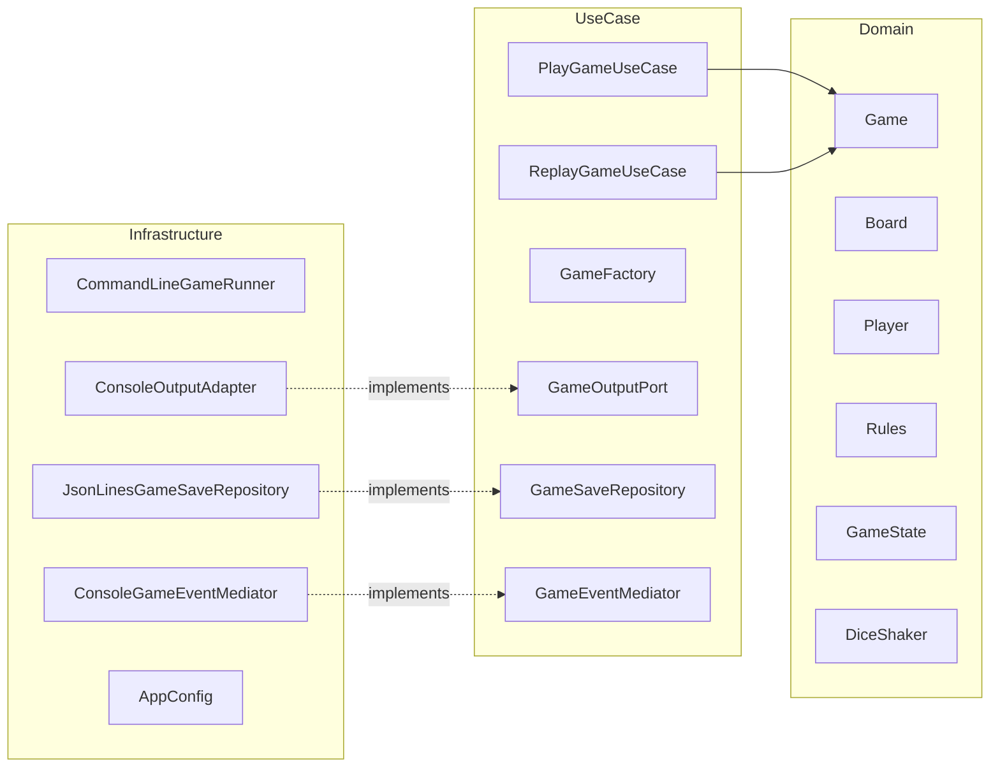

## **Simple Frustration Game - Software Design and Architecture report**

---

## 1. Introduction

This system is an entirely console-based simulation of a simple **Frustration Board Game**
implemented in Java 25 using **Clean Architecture**, also known as **Ports and
Adapters** using the object-oriented principles, patterns and techniques taught throughout the
module.

The primary focus of the project was not only the production of a working game, 
but to **demonstrate the ability to design high-quality software** using the 
concepts and techniques introduced and taught throughout the module. Therefore, design quality, 
extensibility, and architectural correctness were prioritised over minimising code size 
or complexity.

This document **critically evaluates** the architectural and design
decisions made, diving into what techniques were used, why they were chosen,
how they were applied, and why alternative approaches were
deliberately not used.

---

## 2. Functional Overview

The program performs the following functionality:

- initially we configure a board and the correct number of players depending on the rules applied
  to the game
- player turns are automatically alternated by the program
- depending on the dice rules (if applied), either one or two dice are rolled
- optional variations/rules are applied through the usage of flags passed through the CLI
- the relevant information, including dice roll sequences and player turn information is printed
  to the console
- once a winning condition is detected a summary is printed to the console
- stores completed games

---

## 3. How to Run the Application

### Build and Execution

- The program is solely run from the command line as required.
- Despite the fact **Spring Boot** is used, it is **solely used as a dependency
  injection container** for the function of wiring ports, adapters, and use cases.
- There is no Spring-specific logic in the domain or use-case layers.

Because Spring Boot and other dependencies are provided by **Maven**, 
the project must be built before execution. to run it, run `mvn clean package` 
from the project root (where the `pom.xml` is) to create a runnable JAR file in the
`target/` directory, this command also compiles the source code, runs unit tests and
resolves dependencies.

To execute the JAR run the following command:

```
java -jar target/game-*.jar [options]
```
Command-Line Flags:

The game can be customised with the use of command-line flags. All flags are handled inside 
the infrastructure layer, to be more specific in `(uk.ac.mmu.game.infrastructure.CommandLineGameRunner)`,
this makes sure configurations and delivery concerns are separate and don't start leaking into
the domain or use-case layers.
---
Board Configuration
Flag: --large-board 

Description: 

This flag makes the program use the large board (36 main positions, 6 tail positions). 
If it is not specified the default small board(18 main positions, 3 tail positions) is used.
---
Player Configuration 
Flag: --players=N 

Description: 

- Valid values are **2** or **4**
- **4 players are only permitted when `--large-board` is supplied**
- If `--players=4` is provided without `--large-board`, the application will
  reject the configuration and terminate with an error message

---
Number of dice
Flag: --single	

Description: 

Instead of using two dice (default behaviour), this flag changes the program
to use one die.

---
Rule Variations
Flag: --exact-end 

Description: 

Players have to land exactly on the final position to win, they must continue to
roll until they land exactly on the final position.

Flag --forfeit-on-hit

Description: 

If a player happens to land on a position that is already occupied by another 
player, the player that landed on the occupied position will lose their turn.

---
Save and Replay Features

Flag: --list-saves 

Description: 

Prints out all saved games along with their
game configurations and saved dice sequences to the console using the JSON file.

Flag: --replay=<uuid>

Description: 

Using the uuid of a saved game, this replays a saved game using 
its dice sequences and game rules from that session.
---

There is an append-only JSON Lines (NDJSON) file which holds all saved games and is located at:

```
<project-root>/target/saves/games.json
```

To deterministically replay the saved games, we store the exact sequence of dice rolls and
the game configurations/rules that were used in the game, this also allows you to replay without
having to serialise internal domain state.

Example Commands:

To simulate a game with no extra rules or variations, run:

```java -jar target/game-*.jar```

Play a large-board game with 4 players, single die, and all rule variations, run:

```java -jar target/game-*.jar --large-board --players=4 --single --exact-end --forfeit-on-hit```

To list all the saved games, run:

```java -jar target/game-*.jar --list-saves```

to replay a saved game:

```java -jar target/game-*.jar --replay=<uuid>```

All the command-line parsing, validation, and routing logic is housed in the
infrastructure layer. Parsed configuration values are passed into use cases
(PlayGameUseCase, ReplayGameUseCase) as primitive values, preserving
Clean Architecture dependency rules and ensuring the domain remains 
completely free of frameworks.

---

## 4. Architectural Approach

### 4.1 Clean Architecture

The codebase uses **Clean Architecture**, which can also be known as **Ports and Adapters**. 
This design structure was selected because of its strict separation between core business
logic and external concerns.

The project is organised into three layers:

- **Domain layer** – holds all the business logic and game rules
- **Use Case layer** – coordinates application behaviour and workflows
- **Infrastructure layer** – manages input/output, persistence, configuration, 
and frameworks

One integral part of the **Clean Architecture** structure is that **dependencies must always point
inwards**. Here is how it has been done:

- the domain layer has no knowledge of Spring, files, JSON, or console output
- use cases depend only on domain abstractions
- infrastructure depends on domain and use case interfaces

By enforcing this, we can ensure that the domain remains independent of a framework,
is testable in isolation and is also resilient to changes in delivery mechanisms.

#### Clean Architecture vs MVC

Despite Model-View-Controller (MVC) being very dominant in the industry as the go-to 
structure, this was deliberately not used as MVC assumes a user-driven interface
and has risks of allowing controllers to build up into large files and taking on
excess responsibility, leading to the difficulty of maintaining the code when other 
developers begin to work on the codebase. 

Moreover, MVC can lead to what’s called **anemic domain models**. This happens when
the important logic gets pulled out of the main classes and ends up scattered in 
controllers or views. Leaving domain classes holding data, instead of actually doing
anything useful, which makes the code less cohesive and harder to follow.

With Clean Architecture, all the logic lives alongside the data in the
same classes, which is a much better fit for this project, where there are lots of rules 
and logic at the heart of the system.

---

## 5. Architectural Overview

The component diagram below displays the structure of the codebase while simultaneously 
displaying the directions of dependencies.


```mermaid
flowchart LR
    subgraph Domain
        Game
        Board
        Player
        Rules
        GameState
        DiceShaker
    end

    subgraph UseCase
        PlayGameUseCase
        ReplayGameUseCase
        GameFactory
        GameOutputPort
        GameSaveRepository
        GameEventMediator
    end

    subgraph Infrastructure
        CommandLineGameRunner
        ConsoleOutputAdapter
        JsonLinesGameSaveRepository
        ConsoleGameEventMediator
        AppConfig
    end

    PlayGameUseCase --> Game
    ReplayGameUseCase --> Game

    ConsoleOutputAdapter -.implements.-> GameOutputPort
    JsonLinesGameSaveRepository -.implements.-> GameSaveRepository
    ConsoleGameEventMediator -.implements.-> GameEventMediator
```
The diagram serves as a visual reinforcement of the **Dependency Inversion Principle**,
showing that infrastructure depends on usecase and domain, usecase depends on domain, 
and domain has no dependencies on either usecase or infrastructure.

For example, ConsoleOutputAdapter implements the GameOutputPort interface defined
in the use-case layer, and JsonLinesGameSaveRepository implements the 
GameSaveRepository port.

## 6. Domain Model Design

#### 6.1 Rich Domain Model

Within the domain layer, all the important rules of the game live in classes including
Game, Board, Player, MoveResult, rule abstractions, dice abstractions and other
explicit game state logic.

The domain model is also created with the intention of keeping the data and the logic that
operates on that data together instead of separate, this helps to make sure we don't have
useless classes lying around. This improves the overall **cohesion and readability** of the system.

The below approach highlights how I have enforced encapsulation and well cohesive code,
making sure that responsibilities are clearly defined and grouped logically.

- The Game class takes care of things like whose turn it is, moving between different 
phases of the game, and making sure all the rules are followed.

- The Board class handles everything to do with player positions—figuring out where everyone is,
managing wrap-around movement, and creating the right labels for each spot on the board.

- The Player class keeps track of how far each player has progressed and keeps a count of
how many turns they've taken.

## 7. Design Patterns in Practice

This section will focus on design patterns, more specifically an evaluation
of each design pattern used, showing and describing where they appear, why it was chosen,
a highlight of the benefits they provide and will cover why alternative design patterns were
deliberately not used.


#### 7.1 Strategy Pattern – Dice Behaviour

The **Strategy Pattern** in a nutshell:

- defines a family of algorithms
- will encapsulate each one
- makes them interchangeable

The algorithm can be selected at runtime without having to change the code that uses it.

New dice strategies can be introduced using this design pattern, adhering to the 
Open for extension/Closed for modification Principle

#### Where used
- Interface: `uk.ac.mmu.game.domain.DiceShaker`
- Implementations:
  - `RandomSingleDiceShaker`
  - `RandomDoubleDiceShaker`
  - `FixedSeqShaker`

```
public interface DiceShaker {
    int shake();
}
```

#### Why used:

The ability to switch between variations, such as a single die or two dice, or even a 
fixed sequence for replays is easily accessible using the strategy pattern, as the rest of
the game code remains the same.

#### Benefits:

- removes conditional logic that can be messy from the game loop

- supports the Open/Closed Principle

- Makes it possible to replay games exactly as they happened, needed for testing or demos

#### Trade-offs:

- introduces additional abstraction layers

#### Why alternatives were rejected:

- conditional logic violates the **Open/Closed Principle**

- inheritance-based game variants can **scale poorly** and **duplicates logic**

#### 7.2 Decorator Pattern – Rule Variations

The Decorator approach makes it easy to mix and match different rule variations by
stacking up as many decorators as you need, allowing everything to still work
through a single, consistent rules interface.

#### Where used

- **Interface:** `uk.ac.mmu.game.domain.Rules`
- **Concrete base implementation:**
  - `BasicRules`
- **Decorator implementations:**
  - `ExactEndDecorator`
  - `ForfeitOnHitDecorator`
- **Composition location:**
  - `uk.ac.mmu.game.usecase.GameFactory` (rules are wrapped conditionally at creation time)

```java
public interface Rules {
  MoveResult apply(Board board, Player current, int roll, List<Player> allPlayers);
}
```

#### Why used:

Decorators give the ability to add multiple rules to be added at the same time
while keeping only one single rules interface.

#### Benefits:

- combine rules however you want

- there is no code or logic duplication

- keeps rules closed for modification, once again adhering to the **Open for extension,
closed for modification** principle

#### Trade-offs:

- increased indirection as behaviour becomes layered through multiple decorators

#### Why alternatives were rejected:

- boolean flags introduce complex conditional logic

- inheritance leads to an unmanageable proliferation of subclasses

#### 7.3 State Pattern – Game Lifecycle

The State pattern allows an object to alter its behaviour when its internal state changes. 
Each state is represented by a separate class, and behaviour is delegated to the current 
state.

The state pattern gives a class the ability to alter
its behaviour depending on what the internal state is. each state will have its
own class responsible for a certain variation of behaviour, the main class hands the work
to whichever class is linked to the current internal state.

#### Where used

- **Interface:** `uk.ac.mmu.game.domain.GameState`
- **Implementations:**
  - `ReadyState`
  - `InPlayState`
  - `GameOverState`
- **Context:**
  - `uk.ac.mmu.game.domain.Game` (delegates turn execution to the active state)

```java
public interface GameState {

    String name();

    default void enter(Game game) {
        // Optional lifecycle hook
    }

    MoveResult playTurn(Game game);
}
```

the diagram below shows the flow of states throughout the session.
```
stateDiagram-v2
    [*] --> Ready
    Ready --> InPlay : first turn
    InPlay --> GameOver : win condition
    GameOver --> GameOver : further turns
```

#### Why used:

As the game moves through the session and the internal state changes (as shown above), 
duplicated conditional logic can be replaced with polymorphism.

#### Benefits:

- ensures states are correct throughout the session, improving clarity.


#### Trade-offs:

- additional classes

#### 7.4 Observer Pattern – Output and Events

The **Observer Pattern** allows different output mechanisms to be plugged in
by allowing the relevant events, such as turns taken or state changes to be published
without having any knowledge of who will react to them, keeping domain purely for business
logic and separated from code concerned with output.

#### Where used

- **Observer interfaces (domain layer):**
  - `uk.ac.mmu.game.domain.GameObserver`
  - `uk.ac.mmu.game.domain.GameStateObserver`
  - `uk.ac.mmu.game.domain.PlayerTurnObserver`
  - `uk.ac.mmu.game.domain.GameFinishedObserver`

- **Subject (event source):**
  - `uk.ac.mmu.game.domain.Game`

- **Concrete observer implementations (infrastructure layer):**
  - `uk.ac.mmu.game.infrastructure.ConsoleOutputAdapter`

- **Attachment of observers:**
  - `uk.ac.mmu.game.usecase.PlayGameUseCase`
  - `uk.ac.mmu.game.usecase.ReplayGameUseCase`

```java
public interface GameObserver
        extends GameStateObserver, PlayerTurnObserver, GameFinishedObserver {
}
```

#### Benefits:

- the domain logic doesn't concern itself with any output code

- output implementations can be extended or changed without having to touch the core game logic 

- keeping logic tight and in focused classes makes testing easier

#### Why alternatives were rejected:

Keeping the output code in the domain layer would break **Clean Architecture
Principles** and the **Dependency Inversion Principle** as core business logic would then depend on
concrete output implementations.

#### 7.5 Factory Pattern – Game Construction

To ensure complicated objects are created consistently each time, the **Factory Pattern** can
be used by putting object creation logic in one place, also making it easier to locate and modify if needed.

#### Where used

- **Factory class (use case layer):**
  - `uk.ac.mmu.game.usecase.GameFactory`

- **Factory methods:**
  - `create2P(...)`
  - `createGame(...)`
  - `createFromSave(...)`

- **Clients of the factory:**
  - `uk.ac.mmu.game.usecase.PlayGameUseCase`
  - `uk.ac.mmu.game.usecase.ReplayGameUseCase`

```java
public class GameFactory {

    public Game createGame(int mainSize,
                           int tailSize,
                           int players,
                           boolean singleDie,
                           boolean exactEnd,
                           boolean forfeitOnHit) {

        DiceShaker baseDice = singleDie
                ? RandomSingleDiceShaker.INSTANCE
                : RandomDoubleDiceShaker.INSTANCE;

        DiceShaker dice = new RecordingDiceShaker(baseDice);

        Board board = new Board(mainSize, tailSize);
        List<Player> playerList = buildPlayers(players);

        Rules rules = buildRules(exactEnd, forfeitOnHit);

        return new Game(board, playerList, rules, dice);
    }
}
```

#### Benefits:

- prevents invalid game construction

- simplifies use case logic

- supports deterministic replay

#### 7.6 Singleton Pattern – Stateless Dice

The **Singleton Pattern** ensures **only one instance** of a class exists, while also
providing a global access point to it.

#### Where used

- **Singleton implementations (domain layer):**
  - `uk.ac.mmu.game.domain.RandomSingleDiceShaker`
  - `uk.ac.mmu.game.domain.RandomDoubleDiceShaker`

- **Access pattern:**
  - Exposed via public static final `INSTANCE` fields
  - Constructor made private to prevent external instantiation

```java
public final class RandomSingleDiceShaker implements DiceShaker {

    public static final RandomSingleDiceShaker INSTANCE =
            new RandomSingleDiceShaker();

    private RandomSingleDiceShaker() { }

    @Override
    public int shake() {
        return random.nextInt(6) + 1;
    }
}
```

#### Benefits:
- In this case, Singleton is safe because the dice implementations are
  stateless and immutable, avoiding the usual risks associated with global mutable state.

#### Trade-offs:

- This approach becomes unsuitable if the code is ever extended to use mutable state.

## 8. SOLID Principles

The SOLID principles gave an essential guide to follow throughout the creation of the
system, by adhering to these principles, all the code follows the best practices. 

#### 8.1 Single Responsibility Principle (SRP)

This principle is all about making sure each class only has one job to prevent overloading
classes with too much functionality, preventing SRP violations when it is reviewed and 
guaranteeing other developers will not have a difficult time understanding your work.

- The dice logic is coded independently to the game logic, meaning the game logic has no 
knowledge of the dice functionality.

- Output functionality does not leak into other aspects of the code through the use of
independent classes like `ConsoleOutputAdapter`

#### 8.2 Open/Closed Principle (OCP)

This principle is all about making sure the code is easy to add to without having to 
rewrite or mess around with code that already works. In order to achieve this I primarily
focused on my use of design patterns.

- Rule variations are plugged in using the Decorator pattern (ExactEndDecorator, 
ForfeitOnHitDecorator), so you never have to change the core BasicRules.

- You don't ever have to change the core BasicRules because further rules for variations
(like `ExactEndDecorator` or`ForfeitOnHitDecorator`) are added using the decorator pattern, 
just layering them on top of what already exists.

- Dice behaviour can be swapped out using the Strategy pattern, meaning you can add new 
dice types without touching the Game class itself.

#### 8.3 Liskov Substitution Principle (LSP)

LSP allows you to swap out any implementation of an interface without breaking existing 
functionality, for instance:

- All decorators (like `ExactEndDecorator` and `ForfeitOnHitDecorator`) implement the same 
Rules interface.
- Regardless of a Rules object being decorated, it can be used wherever an instance of Rules
is required

#### 8.4 Interface Segregation Principle (ISP)

Smaller focused interfaces were used instead of larger ones with more responsibility, for example:

- Observers are abstracted into targeted classes such as GameStateObserver,
  PlayerTurnObserver and GameFinishedObserver so instead of using a large interface where you
  won't need half the code in there, this approach keeps the system easy to work with as you
  know which interfaces are responsible for certain things.

#### 8.5 Dependency Inversion Principle (DIP)

Instead of high-level parts of the system depending on low-level details, this principle
flips it so that they both depend on abstractions, in practice:


- The domain layer only talks to interfaces, never to actual infrastructure code. 
- Use cases interact with classes such as GameSaveRepository or GameOutputPort for things
like saving and output as opposed to using concrete classes.
- The Infrastructure layer, which includes functionality like console printing or file storage
plugs into these abstractions instead of it being the other way around.

#### 8.6 Summary of SOLID Application

By following the SOLID principles, the system becomes:

- loosely coupled between different layers.
- readable and cohesive throughout the entire codebase
- Easy to extend or change without rewriting working code

## 9. Persistence and Replay Functionality

All saved game entries are going to be saved into the append-only JSON file located at
`<project-root>/target/saves/games.json`, it is stored in JSON Lines (NDJSON) format,
also containing any game configurations and exact dice roll sequences.

To guarantee an identical output of the saved game, we reconstruct a new game and
re-inject the original dice roll sequences and game configurations.

## 10. Testing Strategy

- domain and use-case layers house all complex game logic, hence unit tests were
only created for these two layers
- The infrastructure layer does not contain much complex logic, proving it to be a 
bad return on investment, this also implements pragmatic testing guidance discussed
during the module.

## 11. Conclusion and Evaluation

I am happy with the outcome of the project, even though using multiple architectural
design patterns and techniques increases the number of moving parts throughout the project,
it creates an environment which improves code clarity and cohesion, meaning other
developers will understand the structure of the project and the responsibilities of 
different classes much easier. 

A more minimalistic approach, while it may be easier for me to code initially, 
introduces concerns when the system needs to be extended, tested or maintained 
whereas a structured approach adhering to best practices and the SOLID principles 
promotes long-term comprehensibility.
